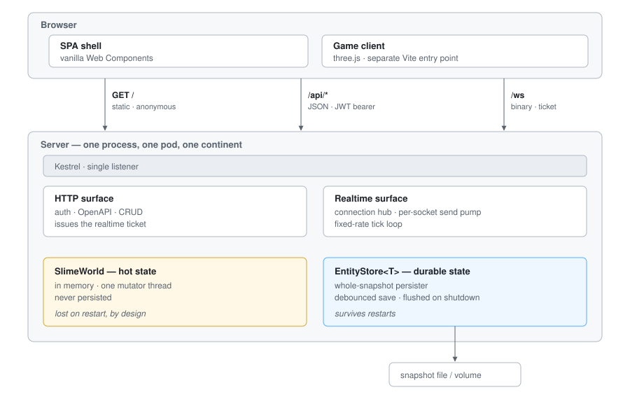

# Technical Design

High-level architecture and the components the system is assembled from. Detail lives elsewhere:

| For | See |
|---|---|
| File layout, endpoints, config keys, CI, client generation | [README.md](../README.md) |
| Realtime wire format, auth handshake, concurrency rules | [docs/REALTIME.md](REALTIME.md) |
| What the game is meant to be | [docs/game-design-document.md](game-design-document.md) |

---

## 1. Architecture

One ASP.NET Core process, one container, one pod. A single Kestrel listener serves three surfaces:

---

## 2. Components

| Component | Where | What it does |
|---|---|---|
| **Host & configuration** | `Configuration/HostConfiguration.cs` | Clears default sources and rebuilds the chain: appsettings → env → user-secrets → command line. Binds `Host`/`Port`. |
| **Authentication** | `Configuration/AuthenticationConfiguration.cs` | JWT bearer against Authentik. Accepts both the API and the SPA client as valid issuer/audience pairs, so one token shape works for both. App-wide fallback policy is `RequireAuthenticatedUser`. |
| **Auth config endpoint** | `Configuration/FrontendConfigEndpoints.cs` | `GET /api/auth-config` — public OIDC settings served at runtime, not baked into the bundle, because one image deploys to several Authentik environments. |
| **JSON & OpenAPI** | `Configuration/JsonConfiguration.cs`, `AppJsonContext.cs` | Source-generated serialization (AOT-friendly) via a `JsonSerializerContext`. Every DTO must be registered there. `Id<T>` is projected to a string/uuid in the OpenAPI schema. |
| **Logging & telemetry** | `Configuration/TelemetryConfiguration.cs`, `OAuth2TokenProvider.cs` | OpenTelemetry for traces, metrics **and logs**, exported over OTLP. Optional OAuth2 client-credentials auth on the exporter. **Entirely opt-in and never fatal** — no `OpenTelemetry:Endpoint` configured means the whole block is skipped and the app runs on console logging alone. |
| **Health** | `Health/HealthEndpoints.cs` | `GET /health`, anonymous, unconditional 200. Liveness only — deliberately not a readiness or dependency check. |
| **Persistence** | `Stores/` | `EntityStore<T>` plus an optional `EntityStorePersister<T>`: whole-snapshot, debounced, loaded on startup, flushed on shutdown. Pluggable via the two-method `ISnapshotStore`; ephemeral by default, `FileSnapshotStore` when persistent. Cannot overwrite good state with empty. |
| **Realtime** | `Realtime/` | The game transport and the authoritative world. See [REALTIME.md](REALTIME.md). |
| **Messages** | `Messages/` | **Template scaffold, not game state.** Exercises the CRUD/validation/persistence path inherited from `Olve.Template.Api`. |
| **SPA shell** | `frontend/src/` | Vanilla TypeScript, no framework runtime. Vite build, Vitest tests, Biome lint. `api/` is Kiota-generated from `api.json`; `realtime/` is hand-written. |
| **Game client** | `frontend/` (own entry) | Real-time 3D — polygon style with a stylised shader pass, rendered with three.js. Built as a separate Vite entry point so the game bundle carries none of the CRUD/admin UI. |
| **Build & versioning** | `tools/version.cs`, `Dockerfile` | Version derived from git; the SPA is built and copied into `wwwroot` at image build time. |
| **Deployment** | `.pipelines/`, `helm/` | GitOps via Olve.Pipelines. ClusterIP-only chart; public routing is registered in Olve.Homelab, not here. |

---

## 3. Cross-cutting constraints

The handful of rules that shape everything else:

- **Exactly one server process may run at a time** (`replicaCount: 1`, `strategy: Recreate`). The
  world exists only in that process's memory, so a second pod would not share the load — it would
  run a *second, separate world*, and the Service would send some players to one and some to the
  other with nothing logged and no error raised. The cost of the rule is that every deploy
  disconnects everyone.
- **The tick loop never blocks.** It hands each connection a frame and moves on; a slow client can
  never apply backpressure to the simulation.
- **Clients are sent absolute state, newest wins.** Each connection holds one outbound slot for world
  state, and a new snapshot replaces an unsent one — a client that stalls resumes at the current
  world rather than replaying stale ones. Control frames travel a separate reliable lane and are
  never dropped.
- **Authority comes from the socket, not the frame.** No inbound frame carries an actor id, so there
  is no such thing as a message that acts on someone else's slime.
- **`RealtimeProtocol.cs` and `frontend/src/realtime/protocol.ts` are one contract with no compiler
  between them.** Change both; tests pin the layout by byte offset.
- **Telemetry is opt-in and never fatal.** Misconfigured or absent observability must not take the
  app down.
- **Durable state is loaded before anything runs and flushed on the way out.** Startup order is
  `StartAsync` (persister loads) → `RunAsyncOnStartup` (seeders, against populated stores) →
  `WaitForShutdownAsync`; on shutdown the persister cancels its debounce timer and writes
  unconditionally, so a clean stop never loses a pending save. Long-running work is a
  `BackgroundService`, not a startup task.
